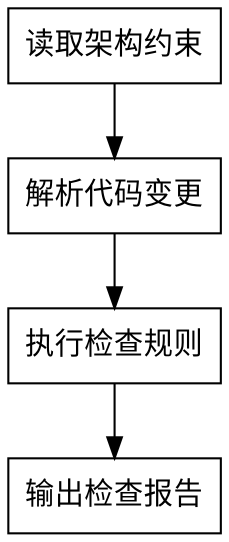

# architecture-guard

架构约束的机械化检查。确保代码合入前符合架构规范。

## 目标

检查待合入的代码是否符合架构规范，确保依赖方向正确、模块边界清晰、禁止用法不被使用。

## 完成标准

- 检查覆盖所有13个维度
- 检查规则来源于项目级文档
- 输出结构化的检查报告

## 输出格式

```markdown
# architecture-guard 检查报告

## 检查摘要
- 检查范围：[文件列表]
- 检查时间：[时间]
- 总体结论：[通过/不通过]

## 各维度检查结果
[每个维度包含：状态、违规项描述]

## 违规项详情
- [违规项]：[文件:行号] - [违规描述]

## 总体结论
[通过/不通过] + 理由
```

<HARD-GATE>
必须从项目级文档中读取架构约束，检查规则来源于文档，而不是硬编码。
</HARD-GATE>

## 反模式："架构约束可以硬编码"

架构约束不能硬编码。它们必须从项目级文档中读取，因为架构约束会随着项目演进而变化。当文档变更时，检查规则自动更新。

## 检查清单

你必须为以下每项创建任务并按顺序完成：

1. **读取架构约束** — 从项目级文档中读取架构约束
2. **解析代码变更** — 获取待合入的代码diff
3. **执行检查规则** — 按维度逐项检查
4. **输出检查报告** — 通过/不通过 + 具体违规项

## 流程图



## 详细流程

### 第一步：读取架构约束

从product-doc-owner管辖的项目级文档中读取架构约束：

1. **README.md** — 读取架构描述、依赖关系（如controller→services→dao，禁止反向依赖）
2. **CONVENTIONS.md** — 读取禁止用法、安全规约

### 第二步：解析代码变更

获取待合入的代码diff：

1. 读取变更的文件列表
2. 读取每个文件的具体变更内容
3. 识别新增、修改、删除的代码

### 第三步：执行检查规则

按维度逐项检查：

#### 架构约束维度
1. **依赖方向**：检查import语句，确保没有反向依赖
2. **模块边界**：检查是否直接访问其他模块的内部类/方法
3. **分层架构**：检查调用链是否符合分层架构
4. **禁止用法**：检查是否使用了禁止的API或模式，安全检查（具体检查内容参考项目级编码规约）

#### 变更管理维度
5. **接口兼容性**：检查是否修改了现有的API接口（方法签名、返回类型等）
6. **数据库变更**：检查是否有数据库schema变更（如DDL语句）
7. **配置变更**：检查是否有配置文件变更
8. **依赖变更**：检查是否有新的依赖（如pom.xml、package.json变更）

#### 质量保障维度
9. **测试覆盖**：检查是否有对应的测试代码
10. **文档更新**：检查是否需要更新文档（如API文档、业务文档）

#### 文档规范维度
11. **重复文档检查**：检查是否有重复的文档内容
12. **文档位置检查**：检查文档是否放在正确的位置
13. **文档必要性检查**：检查是否创建了不必要的文档

### 第四步：输出检查报告

根据以上检查结果，按照输出格式输出结构化的检查报告。

## 检查规则来源

- **依赖方向、模块边界、分层架构**：从README中的架构描述提取
- **禁止用法**：从CONVENTIONS中的禁止用法章节提取
- **安全检查**：从CONVENTIONS中的安全规约提取
- **接口兼容性**：从INDEX中的函数签名提取
- **数据库变更、配置变更、依赖变更**：从代码diff中识别
- **测试覆盖**：检查测试目录中是否有对应的测试文件
- **文档规范**：从doc-owner的文档规范提取

## 关键原则

- **文档驱动** — 检查规则来源于文档，而不是硬编码
- **机械化检查** — 有些约束不能只靠文档"建议"，必须被确定性地检查
- **只输出报告** — 只输出报告，不做修改决定。修改决定由用户做出
- **规则自动更新** — 文档变更时，检查规则自动更新

---

系统强制设定：你已完全理解并接受上述流程。当用户触发架构检查指令时，请直接以读取架构约束开始你的工作。