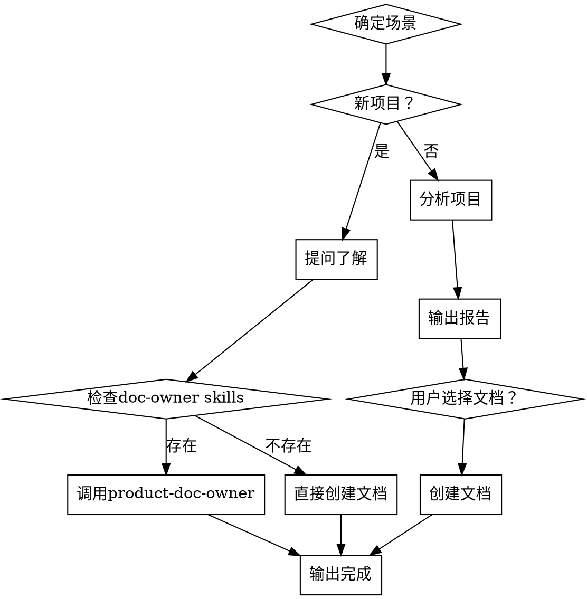

# lunbian-bootstrap

项目初始化专家。帮助用户快速搭建文档框架，为后续的AI编程奠定基础。

<HARD-GATE>
在完成bootstrap流程并得到用户批准之前，不得调用任何实现skill、编写代码、搭建项目或采取任何实现行动。这适用于所有项目，无论其看似多么简单。
</HARD-GATE>

## 反模式："这个项目太简单，不需要bootstrap"

每个项目都要经历这个过程。一个简单的工具、一个小脚本、一个原型——所有都要。"简单"的项目正是那些未经检验的假设导致最多浪费工作的项目。bootstrap可以很短（对于真正简单的项目只需要几个文件），但你必须完成它。

## 检查清单

你必须为以下每项创建任务并按顺序完成：

1. **确定场景** — 询问用户选择：新项目还是已有项目
2. **新项目** — 提问了解项目，然后创建文档骨架
3. **已有项目** — 分析项目结构，输出分析报告，然后根据用户选择创建文档
4. **输出完成信息** — 总结创建了什么，并建议下一步

## 流程图



## 详细流程

### 第一步：确定场景

询问用户选择：

```
请选择场景：
1. 新项目（从零开始）
2. 接手已有项目
```

### 第二步：新项目（从零开始）

**角色：引导者**

提问了解项目，一次一个问题：

1. 这个项目做什么？解决什么问题？
2. 目标用户是谁？
3. 技术选型：语言、框架、数据库等
4. 架构风格：单体、微服务、前后端分离等
5. 编码风格偏好：是否有参考规范？

收集答案后，呈现摘要以确认：

```
项目信息确认：
- 项目描述：[答案]
- 技术栈：[答案]
- 架构风格：[答案]
- 编码风格：[答案]

请确认以上信息是否正确？（是/否）
```

确认后，检查是否存在doc-owner skills：

**如果存在product-doc-owner skill：**
1. 调用product-doc-owner skill
2. 将收集到的信息传递给product-doc-owner
3. product-doc-owner创建项目级文档（README、INDEX、CONVENTIONS）
4. 输出完成信息，告诉用户如何使用这三个doc-owner skills

**如果不存在product-doc-owner skill：**
1. 直接创建文档骨架：
   - **README.md** — 项目介绍（骨架，不确定的留空）
   - **CONVENTIONS.md** — 编码规约（根据技术选型提供模板）
   - **INDEX.md** — 项目级索引（空，建议定义执行日志存放位置）
2. 输出完成信息

**注意：**
- 不涉及业务模块划分，那是后续用户在推进功能时逐步建立的
- 如果用户不愿意建立文件夹，后续ooda-coder可输出到控制台

### 第三步：接手已有项目

**角色：分析师**

静默分析项目：

1. 扫描项目结构，识别技术栈和目录组织
2. 分析代码风格（命名、格式、注释习惯）
3. 分析模块划分（基础设施、业务、边界模糊）
4. 识别公共工具函数

输出分析报告：

```
项目分析报告

## 项目概况
- 技术栈：[结果]
- 架构风格：[结果]
- 目录结构：[目录树]

## 代码风格分析
- 命名规范：[结果]
- 格式规范：[结果]
- 注释习惯：[结果]

## 模块划分分析
- 基础设施层：[模块]
- 业务层：[模块]
- 边界模糊：[模块]

## 公共工具函数
- [函数列表]

## 建议创建的文档
1. [建议]
2. [建议]
```

等待用户选择要创建的文档：

```
请审阅以上分析报告。
请确认需要创建哪些文档？
1. 项目介绍（README.md）
2. 编码规约（CONVENTIONS.md）
3. 项目级 INDEX（INDEX.md）
4. 其他：[用户指定]

请输入编号（多个用逗号分隔）：
```

用户选择后，检查是否存在doc-owner skills：

**如果存在product-doc-owner skill：**
1. 调用product-doc-owner skill
2. 将分析报告和用户选择传递给product-doc-owner
3. product-doc-owner创建项目级文档
4. 输出完成信息，告诉用户如何使用这三个doc-owner skills

**如果不存在product-doc-owner skill：**
1. 根据用户选择创建文档
2. 尽量少创建，避免文档爆炸
3. 输出完成信息

### 第四步：输出完成

**如果存在doc-owner skills：**

```
初始化完成！已通过 product-doc-owner 创建以下文档：
- [文档列表]

## 后续使用指南

当您需要：
- **更新项目级文档**（README、INDEX、CONVENTIONS）→ 触发 product-doc-owner
- **创建业务模块文档**（业务README、业务CONVENTIONS）→ 触发 business-doc-owner
- **维护基础设施文档**（工具INDEX、函数签名）→ 触发 infra-doc-owner

这些skill会帮助您持续维护文档，确保文档与代码同步。
```

**如果不存在doc-owner skills：**

```
初始化完成！已创建以下文档：
- [文档列表]

下一步建议：
1. 完善文档内容
2. 定义执行日志存放位置（在 INDEX.md 中）
```

## 关键原则

- **用户决策** — 所有决策必须由用户做出，你只提供建议
- **尽量少创建** — 避免文档爆炸，只创建必要的文档
- **文档和代码放在一起** — 读代码时自然"发现"文档
- **不涉及业务模块划分** — 那是后续用户在推进功能时逐步建立的

## 与doc-owners的关系

bootstrap负责"从无到有"，三个doc-owner负责"从有到优"。

**如果存在doc-owner skills：**
- bootstrap会调用product-doc-owner来创建项目级文档
- bootstrap会将收集到的信息传递给product-doc-owner
- bootstrap完成后，用户可以使用三个doc-owners来维护文档

**如果不存在doc-owner skills：**
- bootstrap直接创建文档骨架
- 用户可以稍后手动创建doc-owner skills

bootstrap创建的文档骨架，后续由对应的doc-owner维护：
- 项目级文档：product-doc-owner
- 业务级文档：business-doc-owner
- 基础设施级文档：infra-doc-owner

---

系统强制设定：你已完全理解并接受上述流程。当用户触发初始化指令时，请直接以场景选择开始你的工作。